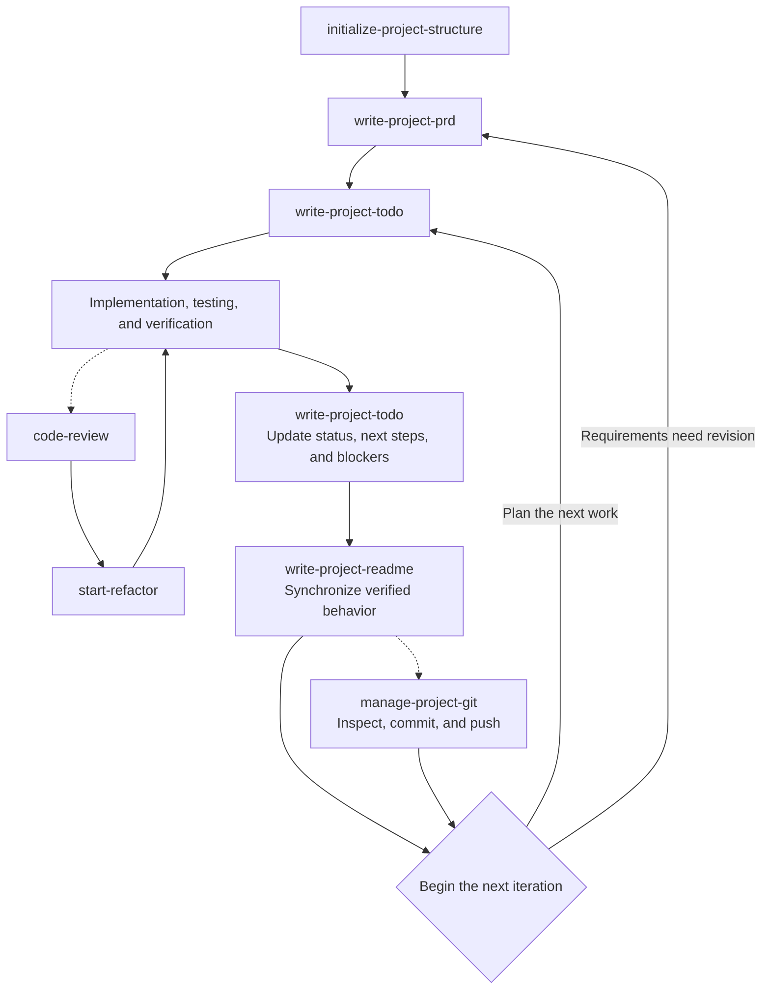

# Codex Project Workflow Skills

[繁體中文](README.md)

This repository collects personal Codex Skills for project and Git initialization, requirements, implementation planning, README and project-document maintenance, cross-session handoffs, commits and uploads, code review, refactoring, and a separately installed UI/UX design skill.

## Skill Sources

| Skill | Source | Description |
|---|---|---|
| `initialize-project-structure` | Authored for this repository | Creates a safe, minimal, technology-agnostic project structure |
| `write-project-prd` | Authored for this repository | Creates or incrementally updates product requirements |
| `write-project-todo` | Authored for this repository | Converts requirements into an actionable, verifiable local implementation plan |
| `write-project-readme` | Authored for this repository | Maintains synchronized Chinese and English README files from repository facts |
| `manage-project-docs` | Authored for this repository | Classifies, consolidates, and checks independent publication value for docs |
| `manage-project-handoff` | Authored for this repository | Creates private handoff snapshots and safely restores cross-session project context |
| `manage-project-git` | Authored for this repository | Uses risk-based depth to safely initialize Git and streamline commit-and-push work |
| `code-review` | External skill with personal modifications | The original source is currently unconfirmed; reviews code without editing it |
| `start-refactor` | External skill with personal modifications | The original source is currently unconfirmed; turns review findings into incremental refactoring |
| `ui-ux-pro-max` | External skill | From [nextlevelbuilder/ui-ux-pro-max-skill](https://github.com/nextlevelbuilder/ui-ux-pro-max-skill); install separately |

Except for the skills explicitly identified as external or adapted above, the remaining skills were authored by this repository's owner.

## Project Workflow

The core self-authored skills first establish the project structure and plan. During development, TODO maintenance, implementation verification, and README updates form a continuous loop, with code review, refactoring, project-document organization, and Git delivery added when needed:



After implementation, synchronize the TODO and then update the README with verified behavior. Return to the PRD when requirements change.

Use `manage-project-docs` and `manage-project-git` independently when documentation cleanup or Git delivery is needed.

`manage-project-handoff` is not part of the fixed cycle above. Use it independently whenever a session switch is needed to preserve user constraints, Git state, verification, decisions, and next steps in a private snapshot. The new session must still revalidate that snapshot against the current repository.

## Skills

### `initialize-project-structure`

Creates a minimal, technology-agnostic project scaffold in an empty directory:

- Creates Chinese and English README files, `TODO.md`, `docs/PRD.md`, `docs/.gitkeep`, the local private directory `docs/private/`, and `src/`.
- Creates a generic `.gitignore` that excludes potentially private `TODO.md`, `docs/PRD.md`, and `docs/private/` content by default; the PRD is tracked only when explicitly requested.
- Explicitly reports the Git tracking state of TODO, PRD, and the private directory after initialization. `docs/private/` has no `.gitkeep`, so consuming skills may need to recreate it compatibly after a clone.
- Validates the directory first to avoid overwriting existing content.
- Does not choose a language, framework, license, or package manager, and does not initialize Git.

### `write-project-prd`

Creates or updates `docs/PRD.md` from user requirements, existing documents, and repository content:

- Defines the problem, goals, scope, and functional and non-functional requirements.
- Uses stable `FR-XXX` IDs and verifiable acceptance criteria.
- Separates confirmed, planned, and open information.
- Preserves valid requirements through incremental updates without breaking down implementation tasks or writing code.
- Keeps the PRD local, private, and Git-ignored by default; it adds a missing rule incrementally and stops on unconfirmed existing tracking.

### `write-project-todo`

Converts the PRD and current project state into a local `TODO.md`:

- Breaks work into appropriately sized tasks with stable `TASK-XXX` IDs.
- Orders real dependencies and checks for cycles and blockers.
- Marks tasks complete only with credible evidence.
- Completing a TASK does not mean its FR has passed acceptance.
- Does not modify the PRD or execute tasks automatically.
- Keeps TODO local, private, and Git-ignored by default; it reviews internal tracking and sensitive content before any explicit publication.

### `write-project-readme`

Creates or synchronizes `README.md` and `README.en.md` from actual repository content:

- Inspects code, configuration, tests, documentation, attribution, and release information.
- Keeps the Traditional Chinese and English versions semantically equivalent.
- Distinguishes implemented, planned, and unconfirmed content.
- Preserves accurate human-written content through incremental updates without inventing features, versions, links, or test results.
- Treats TODO, PRD, and `docs/private/` as private inputs and creates only a minimal public projection independently supported by public evidence.

### `manage-project-docs`

Uses a two-phase workflow to organize development records and maintained documentation under `docs/`:

- Phase one is read-only and reports each file's summary, classification, Git state, and proposed action as useless, needs organization, organized public, or organized private.
- A document qualifies as organized public only when it is independently understandable without private TODOs or PRDs, serves a defined audience, contains verified content, and has a public navigation entry.
- Deletes obsolete files, merges fragments, moves documents, or updates links only after the user approves the exact plan.
- Follows existing documentation conventions first; it may use Diátaxis and project needs to choose directories, but never creates empty categories or content-free documents.
- Reuses the `docs/private/` directory and ignore rule created during initialization. It repairs them compatibly only when an approved plan needs them, while disclosing that tracked files and Git history remain unaffected.
- Treats `docs/private/HANDOFF.md` as the reserved private snapshot for the handoff skill; it is not published, moved, merged, or deleted unless explicitly included in scope.
- Treats `docs/private/` as no substitute for secret storage; real credentials stop the workflow and require revocation or rotation guidance.

### `manage-project-handoff`

Creates or reads `docs/private/HANDOFF.md` to safely transfer immediate context that could be lost between sessions:

- Routes durable rules, product requirements, implementation progress, and public behavior to `AGENTS.md`, PRD, TODO, or README instead of replacing official sources with the handoff.
- Records each user instruction's intent, scope, status, source, lifetime, and conflicts without promoting it to a permanent rule without confirmation.
- Preserves the current objective, Git state, verification results, decision rationale, blockers, risks, and one to three next actions.
- Maintains one current snapshot instead of an append-only session log. It reuses the initialized privacy boundary first and repairs it in Prepare Mode only when absent from a legacy project or clone.
- Revalidates the snapshot against current instructions, files, and Git state in a new session; does not execute TODO items or edit code unless asked to continue.
- Treats `docs/private/` as no substitute for secret storage and never records credentials or complete sensitive values.

### `manage-project-git`

Uses risk-based depth for first-time Git initialization and commit-and-upload work in an existing repository:

- Normal Mode handles low-risk changes with one state check, targeted secret scanning, relevant verification, exact staging, one fetch, and post-push comparison.
- First initialization, unfamiliar files, binary or large artifacts, private documentation, and high-risk code use Enhanced Mode.
- Scans, verification, fetches, and routine file-size reports are not repeated while files, index, HEAD, and remote remain unchanged.
- May invoke README, TODO, PRD, documentation-management, or code-review skills, then reruns only affected checks.
- Treats TODO, PRD, and `docs/private/` as protected paths. A generic “upload everything” request does not publish them; unexpected tracked, staged, or outgoing content causes a stop.
- Stops on secrets, mixed pre-existing staged content, version divergence, conflicts, or failed verification and lets the user choose; never rewrites history or force-pushes automatically.
- Complete procedures for the three modes live under `references/`; the main skill handles only risk selection, shared baselines, and loading routes.

### `code-review`

Reviews code for correctness, security, performance, architecture, and maintainability:

- Reports evidence-backed findings by severity with trigger conditions, locations, impact, and remediation guidance.
- Provides suggestions or diff examples without changing files or Git state, and never starts refactoring automatically.
- Applies Dart and Flutter guidance conditionally from project configuration instead of forcing architecture, lint packages, or dependency upgrades.

This skill was adapted from an external version and personally modified; its original source is currently unconfirmed.

### `start-refactor`

Turns code-review findings into small, verifiable refactoring steps:

- Revalidates findings against current code and preserves existing or unrelated worktree changes.
- Keeps external behavior stable for pure refactoring; behavior-changing defect or security fixes require explicit authorization.
- Prioritizes relevant automated tests, lint, type checks, and builds, using manual checks only for hard-to-automate behavior.
- Synchronizes TODO and README when progress or public behavior changes, but never creates a handoff, commit, or push automatically.

This skill was adapted from an external version and personally modified; its original source is currently unconfirmed.

### `ui-ux-pro-max`

A UI/UX design assistance skill from [nextlevelbuilder/ui-ux-pro-max-skill](https://github.com/nextlevelbuilder/ui-ux-pro-max-skill). This repository stores only its source link; follow the upstream instructions to install it separately.

## Directory Structure

```text
.
├── initialize-project-structure/
├── write-project-prd/
├── write-project-todo/
├── write-project-readme/
├── manage-project-docs/
├── manage-project-handoff/
├── manage-project-git/
├── code-review/
├── start-refactor/
├── README.md
└── README.en.md
```

Each self-authored bilingual skill directory contains a Chinese `SKILL.md`, an English `SKILL_en.md`, and `agents/openai.yaml`; both externally adapted skills also provide interface metadata. Skills that use progressive disclosure keep on-demand rules under `references/`.

## Shared Design Principles

- Chinese `SKILL.md` is the primary version, with an English version kept semantically synchronized.
- YAML `name` values use English kebab-case; commands, paths, and identifiers remain unchanged.
- Use existing context and repository facts first; never invent requirements, implementation, versions, progress, or verification results.
- Keep durable rules, product requirements, implementation planning, session handoff, code changes, and public documentation responsibilities separate.
- Prefer incremental updates that preserve accurate and useful human-written content.
