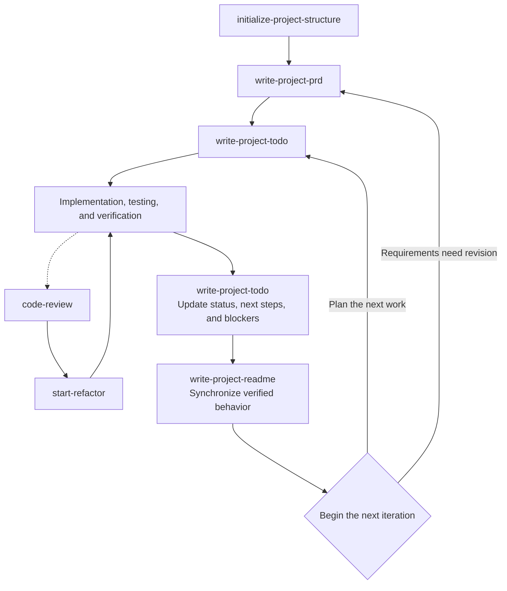

# Codex Project Workflow Skills

[繁體中文](README.md)

This repository collects personal Codex Skills for project initialization, requirements, implementation planning, README maintenance, code review, refactoring, and a separately installed UI/UX design skill.

## Skill Sources

| Skill | Source | Description |
|---|---|---|
| `initialize-project-structure` | Authored for this repository | Creates a safe, minimal, technology-agnostic project structure |
| `write-project-prd` | Authored for this repository | Creates or incrementally updates product requirements |
| `write-project-todo` | Authored for this repository | Converts requirements into an actionable, verifiable local implementation plan |
| `write-project-readme` | Authored for this repository | Maintains synchronized Chinese and English README files from repository facts |
| `code-review` | External skill with personal modifications | The original source is currently unconfirmed; reviews code without editing it |
| `start-refactor` | External skill with personal modifications | The original source is currently unconfirmed; turns review findings into incremental refactoring |
| `ui-ux-pro-max` | External skill | From [nextlevelbuilder/ui-ux-pro-max-skill](https://github.com/nextlevelbuilder/ui-ux-pro-max-skill); install separately |

Except for the skills explicitly identified as external or adapted above, the remaining skills were authored by this repository's owner.

## Project Workflow

The four self-authored skills first establish the project structure and plan. During development, TODO maintenance, implementation verification, and README updates form a continuous loop, with code review and refactoring added when needed:



After each implementation cycle, first use `write-project-todo` to update completion status, next steps, and blockers, then use `write-project-readme` to synchronize verified behavior into both README files. The next iteration can return directly to TODO planning; when product requirements need revision, return to the PRD first and then replan the TODO.

## Skills

### `initialize-project-structure`

Creates a minimal, technology-agnostic project scaffold in an empty directory:

- Creates Chinese and English README files, `TODO.md`, `docs/PRD.md`, and `src/`.
- Creates a generic `.gitignore` that excludes the local `TODO.md`.
- Validates the directory first to avoid overwriting existing content.
- Does not choose a language, framework, license, or package manager, and does not initialize Git.

### `write-project-prd`

Creates or updates `docs/PRD.md` from user requirements, existing documents, and repository content:

- Defines the problem, goals, scope, and functional and non-functional requirements.
- Uses stable `FR-XXX` IDs and verifiable acceptance criteria.
- Separates confirmed, planned, and open information.
- Preserves valid requirements through incremental updates without breaking down implementation tasks or writing code.

### `write-project-todo`

Converts the PRD and current project state into a local `TODO.md`:

- Breaks work into appropriately sized tasks with stable `TASK-XXX` IDs.
- Orders real dependencies and checks for cycles and blockers.
- Marks tasks complete only with credible evidence.
- Completing a TASK does not mean its FR has passed acceptance.
- Does not modify the PRD or execute tasks automatically.

### `write-project-readme`

Creates or synchronizes `README.md` and `README.en.md` from actual repository content:

- Inspects code, configuration, tests, documentation, attribution, and release information.
- Keeps the Traditional Chinese and English versions semantically equivalent.
- Distinguishes implemented, planned, and unconfirmed content.
- Preserves accurate human-written content through incremental updates without inventing features, versions, links, or test results.

### `code-review`

Reviews code for correctness, security, performance, architecture, and maintainability:

- Reports findings by severity with locations, rationale, and remediation guidance.
- Provides suggestions or diff examples without modifying source code.
- Includes additional review guidance for Dart and Flutter.

This skill was adapted from an external version and personally modified; its original source is currently unconfirmed.

### `start-refactor`

Turns code-review findings into small, verifiable refactoring steps:

- Prioritizes high-severity logic and security issues.
- Applies atomic changes while preserving external behavior.
- Reports the review findings addressed, verification performed, and remaining questions.

This skill was adapted from an external version and personally modified; its original source is currently unconfirmed.

### `ui-ux-pro-max`

A UI/UX design assistance skill from [nextlevelbuilder/ui-ux-pro-max-skill](https://github.com/nextlevelbuilder/ui-ux-pro-max-skill). This repository stores only its source link; follow the upstream instructions to install it separately.

## Directory Structure

```text
.
├── initialize-project-structure/
├── write-project-prd/
├── write-project-todo/
├── write-project-readme/
├── code-review/
├── start-refactor/
├── README.md
└── README.en.md
```

Each self-authored bilingual skill directory contains a Chinese `SKILL.md`, an English `SKILL_en.md`, and `agents/openai.yaml` for the Codex interface.

## Shared Design Principles

- Chinese `SKILL.md` is the primary version, with an English version kept semantically synchronized.
- YAML `name` values use English kebab-case; commands, paths, and identifiers remain unchanged.
- Use existing context and repository facts first; never invent requirements, implementation, versions, progress, or verification results.
- Keep product requirements, implementation planning, code changes, and public documentation responsibilities separate.
- Prefer incremental updates that preserve accurate and useful human-written content.
