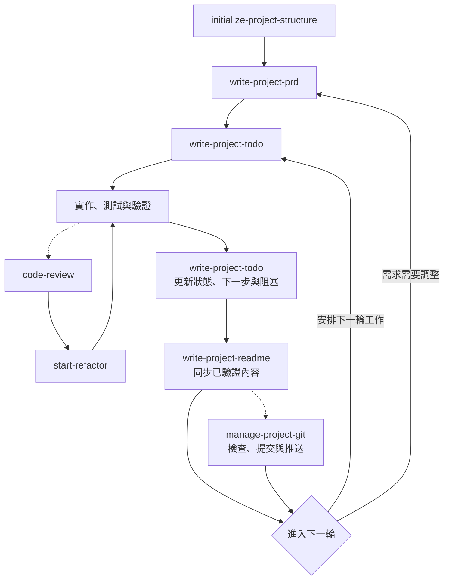

# Codex 專案工作流程 Skills

[English](README.en.md)

本儲存庫整理個人使用的 Codex Skills，涵蓋專案與 Git 初始化、需求文件、實作規劃、README 與專案文件維護、跨 session 交接、提交上傳、程式碼審查、重構，以及需另外安裝的 UI/UX 設計 Skill。

## Skill 來源

| Skill | 來源 | 說明 |
|---|---|---|
| `initialize-project-structure` | 自行撰寫 | 建立安全、最小且技術無關的專案初始架構 |
| `write-project-prd` | 自行撰寫 | 建立或增量更新產品需求文件 |
| `write-project-todo` | 自行撰寫 | 將需求轉換成可執行、可驗證的本機實作規劃 |
| `write-project-readme` | 自行撰寫 | 根據儲存庫事實同步維護中英文 README |
| `manage-project-docs` | 自行撰寫 | 分類、整合並檢查 docs 的獨立公開價值 |
| `manage-project-handoff` | 自行撰寫 | 建立私有交接快照並安全恢復跨 session 專案脈絡 |
| `manage-project-git` | 自行撰寫 | 依風險分級安全初始化 Git，統一精簡提交與推送流程 |
| `code-review` | 外部 Skill 經個人微調 | 原始來源目前未確認；僅進行審查，不直接修改程式碼 |
| `start-refactor` | 外部 Skill 經個人微調 | 原始來源目前未確認；將審查建議轉換成漸進式重構 |
| `ui-ux-pro-max` | 外部 Skill | 來自 [nextlevelbuilder/ui-ux-pro-max-skill](https://github.com/nextlevelbuilder/ui-ux-pro-max-skill)，需另外安裝 |

除上表明確標示的外部或改作 Skill 外，其餘 Skill 均為本儲存庫作者自行撰寫。

## 專案工作流程

核心自製 Skill 先建立專案骨架與規劃；進入開發後，TODO、實作驗證與 README 形成持續循環。程式碼審查、重構、文件整理及 Git 提交上傳可在需要時加入：



實作後先同步 TODO，再將已驗證內容更新到 README；需求改變時回到 PRD 重新規劃。

文件整理與 Git 交付分別按需使用 `manage-project-docs` 與 `manage-project-git`。

`manage-project-handoff` 不屬於上述固定循環；在任何階段需要切換 session 時獨立使用，將使用者限制、Git 狀態、驗證、決策與下一步整理成私有快照。新 session 讀取後仍須對照目前儲存庫重新驗證。

## Skills

### `initialize-project-structure`

在空白目錄建立最小化、技術無關的專案骨架：

- 建立中英文 README、`TODO.md`、`docs/PRD.md`、`docs/.gitkeep`、本機私有目錄 `docs/private/` 與 `src/`。
- 建立通用 `.gitignore`，預設排除可能含內部規劃的 `TODO.md`、`docs/PRD.md` 與 `docs/private/`；只有使用者明確要求時才追蹤 PRD。
- 初始化完成時明確說明 TODO、PRD 與私有目錄的 Git 追蹤狀態；`docs/private/` 不放 `.gitkeep`，因此 clone 後可能需由使用它的 Skill 相容補建。
- 初始化前檢查目錄，避免覆寫既有內容。
- 不選擇程式語言、框架、授權或套件管理工具，也不初始化 Git。

### `write-project-prd`

根據使用者需求、既有文件與儲存庫內容建立或更新 `docs/PRD.md`：

- 定義問題、目標、範圍、功能與非功能需求。
- 使用穩定的 `FR-XXX` ID 與可驗證驗收條件。
- 區分已確認、規劃與待確認資訊。
- 保留有效需求並採增量更新，不拆解實作任務或撰寫程式碼。
- PRD 預設保持本機私有與 Git 忽略；缺少規則時增量補上，既有追蹤未經確認時先停止。

### `write-project-todo`

將 PRD 與目前專案狀態轉換成本機 `TODO.md`：

- 拆解適當粒度的任務，使用穩定的 `TASK-XXX` ID。
- 依相依關係排序，檢查循環依賴與阻塞事項。
- 只有存在可信證據時才標記任務完成。
- TASK 完成不等於對應 FR 已通過驗收。
- 不修改 PRD，也不自動執行任務。
- TODO 預設保持本機私有與 Git 忽略；明確公開前先檢查內部追蹤與敏感內容。

### `write-project-readme`

根據儲存庫的實際內容建立或同步 `README.md` 與 `README.en.md`：

- 檢查程式碼、設定、測試、文件、引用與發布資訊。
- 保持繁體中文與英文版本語意一致。
- 區分已實作、規劃中與未確認內容。
- 保留正確的人工內容並採增量更新，不虛構功能、版本、連結或測試結果。
- 將 TODO、PRD 與 `docs/private/` 視為私有輸入，只建立可由公開證據獨立理解的最小公開投影。

### `manage-project-docs`

以兩階段流程整理 `docs/` 內的開發紀錄與正式文件：

- 第一階段只讀取並逐檔回報簡介、分類、Git 狀態及建議動作，分為無作用、需整理、已整理公開與已整理不公開。
- 只有能脫離私有 TODO／PRD 獨立理解、具明確讀者與閱讀價值、內容已驗證且有公開入口的文件，才能列為已整理公開。
- 只有使用者確認精確方案後，才刪除無用檔案、整合片段、移動文件或更新連結。
- 優先遵循現有文件慣例；可依 Diátaxis 與專案需求選擇目錄，但不建立空分類或無內容文件。
- 優先重用初始化時建立的 `docs/private/` 與忽略規則；只有核准方案需要時才相容補建，並揭露已追蹤檔案與 Git 歷史不受忽略規則保護的風險。
- 將 `docs/private/HANDOFF.md` 視為交接 Skill 的保留私有快照，未經明確納入範圍不公開化、搬移、整合或刪除。
- `docs/private/` 不是機密保管庫；發現真實憑證時停止處理並建議撤銷或輪替。

### `manage-project-handoff`

建立或讀取 `docs/private/HANDOFF.md`，安全傳遞不同 session 間容易遺失的即時脈絡：

- 將長期規範、產品需求、實作進度與公開行為分流至 `AGENTS.md`、PRD、TODO 或 README，不以交接文件取代正式來源。
- 記錄使用者要求的原意、範圍、狀態、來源、期限與衝突，未經確認不升級為永久規範。
- 保存目前目標、Git 狀態、驗證結果、決策理由、阻塞、風險及一至三個下一步。
- 交接快照維持單一最新狀態，不累積成 session log；優先重用初始化時預建的私有邊界，舊專案或 clone 缺失時才由建立模式相容補建。
- 新 session 讀取後先與目前指示、檔案及 Git 狀態比對；除非使用者要求繼續，不自動執行 TODO 或修改程式碼。
- `docs/private/` 不是機密保管庫，交接文件不得保存憑證或完整敏感值。

### `manage-project-git`

依風險分級統一首次 Git 初始化與既有儲存庫的提交上傳流程：

- 一般模式以一次狀態檢查、針對性敏感掃描、必要驗證、精確暫存、一次 fetch 及推送核對完成低風險變更。
- 首次初始化、不明檔案、二進位／大型產物、私有文件或高風險程式碼改用加強模式。
- 檔案、index、HEAD 或 remote 未改變時不重複掃描、驗證與 fetch，也不逐一回報無異常檔案大小。
- 可依變更呼叫 README、TODO、PRD、文件管理或程式碼審查 Skill，修改後只重跑受影響檢查。
- 將 TODO、PRD 與 `docs/private/` 視為受保護路徑；一般「全部上傳」不構成公開授權，意外納入 tracked／staged／outgoing 時停止。
- 發現機密、既有混合暫存、版本分歧、衝突或驗證錯誤時停止，提出方案由使用者選擇；禁止自動改寫歷史或強制推送。
- 三種模式的完整程序分別放在 `references/` 中；主 Skill 只負責風險判定、共通底線與載入路由。

### `code-review`

針對正確性、安全性、效能、架構與可維護性進行程式碼審查：

- 依證據與嚴重程度整理問題、觸發條件、位置、影響及改善方向。
- 提供建議或差異範例，但不修改檔案或 Git 狀態，也不自動啟動重構。
- Dart／Flutter 清單依專案設定條件式套用，不強迫特定架構、lint 套件或相依升級。

此 Skill 由外部來源版本經個人微調而成；原始來源目前未確認。

### `start-refactor`

將程式碼審查結果轉換成小步、可驗證的重構：

- 先驗證 finding 與目前程式碼仍一致，保留工作樹中的既有與無關修改。
- 純重構維持外部行為；會改變行為的缺陷或安全修復需有明確授權。
- 優先執行相關自動化測試、lint、type check 與 build，手動驗證只補足難以自動化的場景。
- 進度或公開行為改變時同步 TODO 與 README，但不自動建立交接、提交或推送。

此 Skill 由外部來源版本經個人微調而成；原始來源目前未確認。

### `ui-ux-pro-max`

UI/UX 設計輔助 Skill，來源為 [nextlevelbuilder/ui-ux-pro-max-skill](https://github.com/nextlevelbuilder/ui-ux-pro-max-skill)。本儲存庫只保留來源連結，使用前需依上游說明自行安裝。

## 目錄結構

```text
.
├── initialize-project-structure/
├── write-project-prd/
├── write-project-todo/
├── write-project-readme/
├── manage-project-docs/
├── manage-project-handoff/
├── manage-project-git/
├── code-review/
├── start-refactor/
├── README.md
└── README.en.md
```

自製雙語 Skill 目錄包含中文 `SKILL.md`、英文 `SKILL_en.md` 與 `agents/openai.yaml`；兩個外部改作 Skill 也提供介面 metadata。需要漸進揭露的 Skill 另以 `references/` 保存按需載入規則。

## 共同設計原則

- 中文 `SKILL.md` 為主要版本，英文版本保持語意同步。
- YAML `name` 使用英文 kebab-case；指令、路徑與識別字保留原文。
- 先使用既有上下文與儲存庫事實，不虛構需求、實作、版本、進度或驗證結果。
- 明確分離長期規範、產品需求、實作規劃、session 交接、程式碼修改與公開文件的責任。
- 優先採增量更新，保留仍正確且有用的人工內容。
