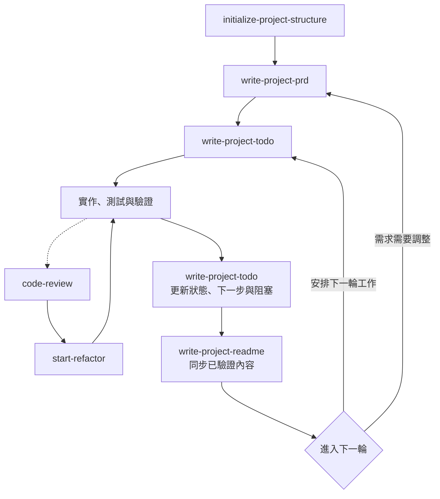

# Codex 專案工作流程 Skills

[English](README.en.md)

本儲存庫整理個人使用的 Codex Skills，涵蓋專案初始化、需求文件、實作規劃、README 維護、程式碼審查、重構，以及需另外安裝的 UI/UX 設計 Skill。

## Skill 來源

| Skill | 來源 | 說明 |
|---|---|---|
| `initialize-project-structure` | 自行撰寫 | 建立安全、最小且技術無關的專案初始架構 |
| `write-project-prd` | 自行撰寫 | 建立或增量更新產品需求文件 |
| `write-project-todo` | 自行撰寫 | 將需求轉換成可執行、可驗證的本機實作規劃 |
| `write-project-readme` | 自行撰寫 | 根據儲存庫事實同步維護中英文 README |
| `code-review` | 外部 Skill 經個人微調 | 原始來源目前未確認；僅進行審查，不直接修改程式碼 |
| `start-refactor` | 外部 Skill 經個人微調 | 原始來源目前未確認；將審查建議轉換成漸進式重構 |
| `ui-ux-pro-max` | 外部 Skill | 來自 [nextlevelbuilder/ui-ux-pro-max-skill](https://github.com/nextlevelbuilder/ui-ux-pro-max-skill)，需另外安裝 |

除上表明確標示的外部或改作 Skill 外，其餘 Skill 均為本儲存庫作者自行撰寫。

## 專案工作流程

四個自製 Skill 先建立專案骨架與規劃；進入開發後，TODO、實作驗證與 README 形成持續循環。程式碼審查與重構可在需要時加入：



每輪實作後，先使用 `write-project-todo` 更新完成狀態、下一步與阻塞事項，再使用 `write-project-readme` 將已驗證的實作同步到中英文 README。下一輪可直接回到 TODO 安排工作；若產品需求需要調整，則先回到 PRD，再重新規劃 TODO。

## Skills

### `initialize-project-structure`

在空白目錄建立最小化、技術無關的專案骨架：

- 建立中英文 README、`TODO.md`、`docs/PRD.md`、`docs/.gitkeep` 與 `src/`。
- 建立通用 `.gitignore`，預設排除可能含內部規劃的 `TODO.md` 與 `docs/PRD.md`；只有使用者明確要求時才追蹤 PRD。
- 初始化完成時明確說明 TODO 與 PRD 的 Git 追蹤狀態，避免私密產品資訊意外公開。
- 初始化前檢查目錄，避免覆寫既有內容。
- 不選擇程式語言、框架、授權或套件管理工具，也不初始化 Git。

### `write-project-prd`

根據使用者需求、既有文件與儲存庫內容建立或更新 `docs/PRD.md`：

- 定義問題、目標、範圍、功能與非功能需求。
- 使用穩定的 `FR-XXX` ID 與可驗證驗收條件。
- 區分已確認、規劃與待確認資訊。
- 保留有效需求並採增量更新，不拆解實作任務或撰寫程式碼。

### `write-project-todo`

將 PRD 與目前專案狀態轉換成本機 `TODO.md`：

- 拆解適當粒度的任務，使用穩定的 `TASK-XXX` ID。
- 依相依關係排序，檢查循環依賴與阻塞事項。
- 只有存在可信證據時才標記任務完成。
- TASK 完成不等於對應 FR 已通過驗收。
- 不修改 PRD，也不自動執行任務。

### `write-project-readme`

根據儲存庫的實際內容建立或同步 `README.md` 與 `README.en.md`：

- 檢查程式碼、設定、測試、文件、引用與發布資訊。
- 保持繁體中文與英文版本語意一致。
- 區分已實作、規劃中與未確認內容。
- 保留正確的人工內容並採增量更新，不虛構功能、版本、連結或測試結果。

### `code-review`

針對正確性、安全性、效能、架構與可維護性進行程式碼審查：

- 依嚴重程度整理問題、位置、原因及改善方向。
- 提供建議或差異範例，但不直接修改原始碼。
- 另含 Dart／Flutter 的審查參考資料。

此 Skill 由外部來源版本經個人微調而成；原始來源目前未確認。

### `start-refactor`

將程式碼審查結果轉換成小步、可驗證的重構：

- 優先處理高嚴重度邏輯與安全性問題。
- 以維持外部行為為前提進行原子化修改。
- 說明修改對應的審查建議、驗證方式與待確認事項。

此 Skill 由外部來源版本經個人微調而成；原始來源目前未確認。

### `ui-ux-pro-max`

UI/UX 設計輔助 Skill，來源為 [nextlevelbuilder/ui-ux-pro-max-skill](https://github.com/nextlevelbuilder/ui-ux-pro-max-skill)。本儲存庫只保留來源連結，使用前需依上游說明自行安裝。

## 目錄結構

```text
.
├── initialize-project-structure/
├── write-project-prd/
├── write-project-todo/
├── write-project-readme/
├── code-review/
├── start-refactor/
├── README.md
└── README.en.md
```

自製雙語 Skill 目錄包含中文 `SKILL.md`、英文 `SKILL_en.md`，以及供 Codex 介面使用的 `agents/openai.yaml`。

## 共同設計原則

- 中文 `SKILL.md` 為主要版本，英文版本保持語意同步。
- YAML `name` 使用英文 kebab-case；指令、路徑與識別字保留原文。
- 先使用既有上下文與儲存庫事實，不虛構需求、實作、版本、進度或驗證結果。
- 明確分離產品需求、實作規劃、程式碼修改與公開文件的責任。
- 優先採增量更新，保留仍正確且有用的人工內容。
